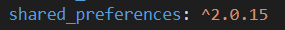
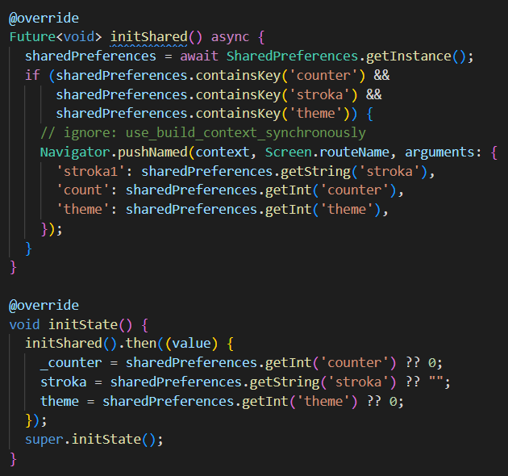
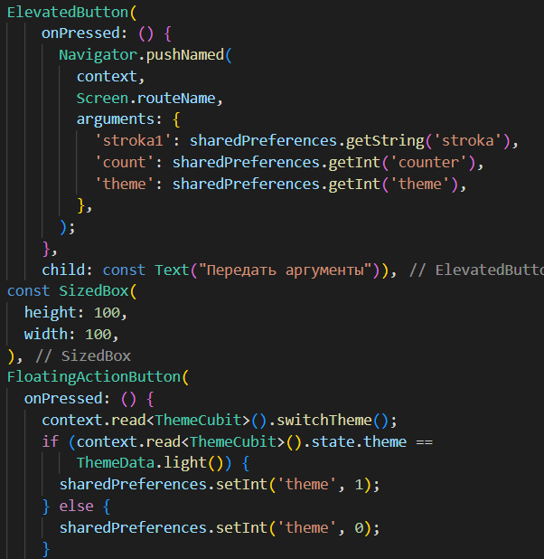
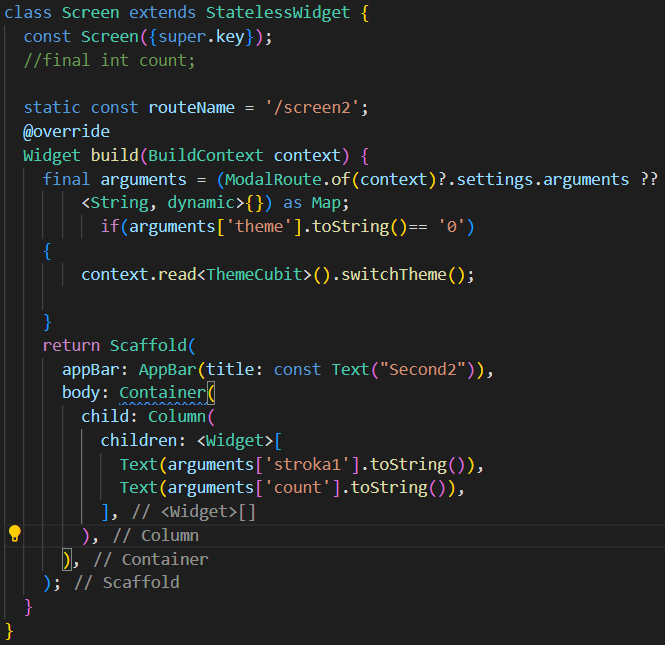
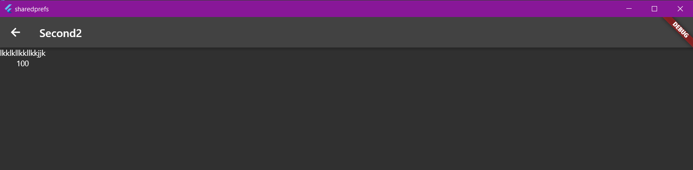
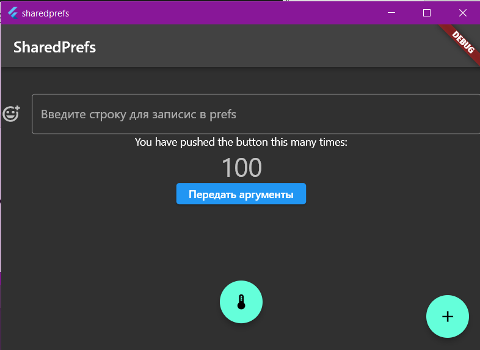

# ПРАКТИЧЕСКАЯ РАБОТА №5

## Работа с передачей данных и библиотекой SharedPreferences.

<b>Цель работы:</b>реализовать передачу данных через параметр arguments и сохранение данных в SharedPrefrences. Реализовать восстановление данных после закрытия приложения. Если есть данные в SharedPrefrences открыть 2 экран, если данных нет, то открыть 1 экран. Так же реализовать восстановление темы приложения.
Ход работы:
Вначале докачиваем библиотеку, для работы с записью данных.
 
 

Рисунок 28 - Shared_Preferences

Затем прописываем код, который позволяет инициализировать SharedPreferences и указанные для инициализации ключи.

 

Рисунок 29 - Инициализация SharedPrefernces

Далее необходимо прописать код для того, чтобы передать ключи с данными на другое окно с помощью arguments, а также необходимо прописать на кнопках методы для записи данных по ключам.
 
 

Рисунок 30 -Передача и запись данных с помощью 

sharedPreferences

Далее прописываем код второго окна, где будет происходить принятие переданных данных, а также вывод данных хранящихся в ключах и смена темы в зависимости от ключа.

 
 
Рисунок 31 - Второй экран с выводом данных из arguments

Далее проверяем результат работы программы и сохранение данных.
 
 

Рисунок 32 - Экран 2
 
 

Рисунок 33 - Главный экран

<b>Вывод:</b> в ходе практической работы удалось реализовать передачу данных через параметр arguments и сохранение данных в SharedPrefrences, а также реализовать восстановление данных после закрытия приложения.
